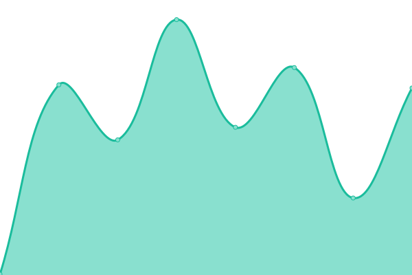
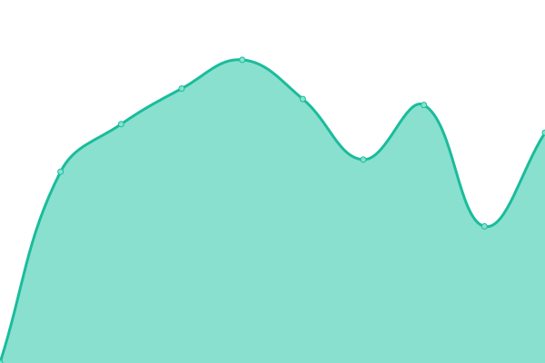
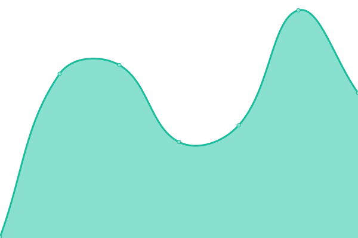
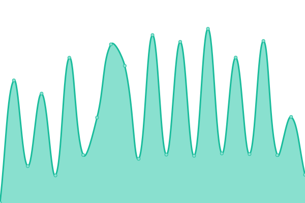
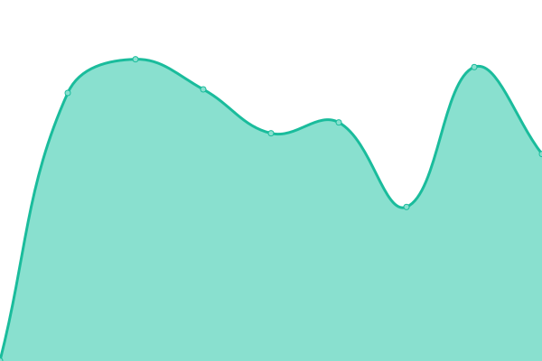
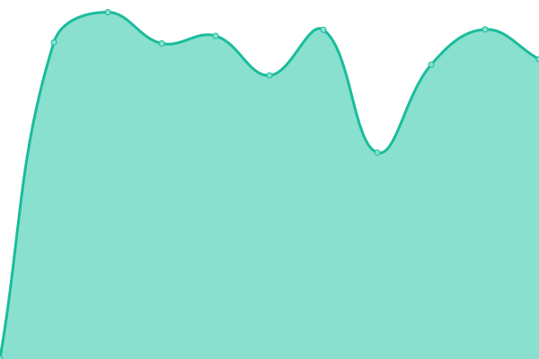

# [📈 Live Status](https://status.perennialte.ch): <!--live status--> **🟩 All systems operational**

This repository contains the open-source uptime monitor and status page for [perennial](https://perennialte.ch), powered by [Upptime](https://github.com/upptime/upptime).

With [Upptime](https://upptime.js.org), you can get your own unlimited and free uptime monitor and status page, powered entirely by a GitHub repository. We use [Issues](https://github.com/perennialtech/upptime/issues) as incident reports, [Actions](https://github.com/perennialtech/upptime/actions) as uptime monitors, and [Pages](https://status.perennialte.ch) for the status page.

<!--start: status pages-->
<!-- This summary is generated by Upptime (https://github.com/upptime/upptime) -->
<!-- Do not edit this manually, your changes will be overwritten -->
<!-- prettier-ignore -->
| URL | Status | History | Response Time | Uptime |
| --- | ------ | ------- | ------------- | ------ |
|  [Main website](https://perennialte.ch) | 🟩 Up | [main-website.yml](https://github.com/perennialtech/upptime/commits/HEAD/history/main-website.yml) | 

 168ms
     
 | 

<a href="https://perennialtech.github.io/upptime/history/main-website">100.00%</a>
    

|  [SearXNG](https://searx.perennialte.ch) | 🟩 Up | [sear-xng.yml](https://github.com/perennialtech/upptime/commits/HEAD/history/sear-xng.yml) | 

 634ms
     
 | 

<a href="https://perennialtech.github.io/upptime/history/sear-xng">100.00%</a>
    

|  [4get](https://4get.perennialte.ch) | 🟩 Up | [4get.yml](https://github.com/perennialtech/upptime/commits/HEAD/history/4get.yml) | 

 830ms
     
 | 

<a href="https://perennialtech.github.io/upptime/history/4get">100.00%</a>
    

|  [Redlib](https://redlib.perennialte.ch) | 🟩 Up | [redlib.yml](https://github.com/perennialtech/upptime/commits/HEAD/history/redlib.yml) | 

 1624ms
     
 | 

<a href="https://perennialtech.github.io/upptime/history/redlib">99.92%</a>
    

|  [Nitter](https://nitter.perennialte.ch) | 🟩 Up | [nitter.yml](https://github.com/perennialtech/upptime/commits/HEAD/history/nitter.yml) | 

 319ms
     
 | 

<a href="https://perennialtech.github.io/upptime/history/nitter">100.00%</a>
    

|  [Invidious](https://invidious.perennialte.ch) | 🟩 Up | [invidious.yml](https://github.com/perennialtech/upptime/commits/HEAD/history/invidious.yml) | 

 1008ms
     
 | 

<a href="https://perennialtech.github.io/upptime/history/invidious">100.00%</a>
    

|  [Rimgo](https://rimgo.perennialte.ch) | 🟩 Up | [rimgo.yml](https://github.com/perennialtech/upptime/commits/HEAD/history/rimgo.yml) | 

 536ms
     
 | 

<a href="https://perennialtech.github.io/upptime/history/rimgo">100.00%</a>
    

|  [Quetre](https://quetre.perennialte.ch) | 🟩 Up | [quetre.yml](https://github.com/perennialtech/upptime/commits/HEAD/history/quetre.yml) | 

 819ms
     
 | 

<a href="https://perennialtech.github.io/upptime/history/quetre">100.00%</a>
    

|  [Rimgo](https://rimgo.perennialte.ch) | 🟩 Up | [rimgo.yml](https://github.com/perennialtech/upptime/commits/HEAD/history/rimgo.yml) | 

 536ms
     
 | 

<a href="https://perennialtech.github.io/upptime/history/rimgo">100.00%</a>
    

|  [AnonymousOverflow](https://overflow.perennialte.ch) | 🟩 Up | [anonymous-overflow.yml](https://github.com/perennialtech/upptime/commits/HEAD/history/anonymous-overflow.yml) | 

 830ms
     
 | 

<a href="https://perennialtech.github.io/upptime/history/anonymous-overflow">100.00%</a>
    

|  [PrivateBin](https://privatebin.perennialte.ch) | 🟩 Up | [private-bin.yml](https://github.com/perennialtech/upptime/commits/HEAD/history/private-bin.yml) | 

 833ms
     
 | 

<a href="https://perennialtech.github.io/upptime/history/private-bin">100.00%</a>
    

|  [Scribe](https://scribe.perennialte.ch) | 🟩 Up | [scribe.yml](https://github.com/perennialtech/upptime/commits/HEAD/history/scribe.yml) | 

 826ms
     
 | 

<a href="https://perennialtech.github.io/upptime/history/scribe">100.00%</a>
    

<!--end: status pages-->

[**Visit our status website →**](https://status.perennialte.ch)

## 📄 License

- Powered by: [Upptime](https://github.com/upptime/upptime)
- Code: [MIT](./LICENSE) © [perennial](https://perennialte.ch)
- Data in the `./history` directory: [Open Database License](https://opendatacommons.org/licenses/odbl/1-0/)
